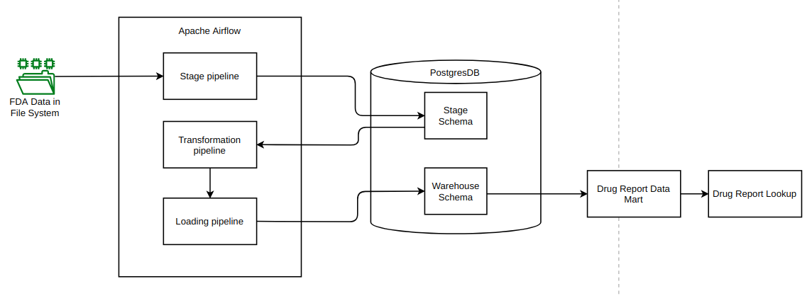
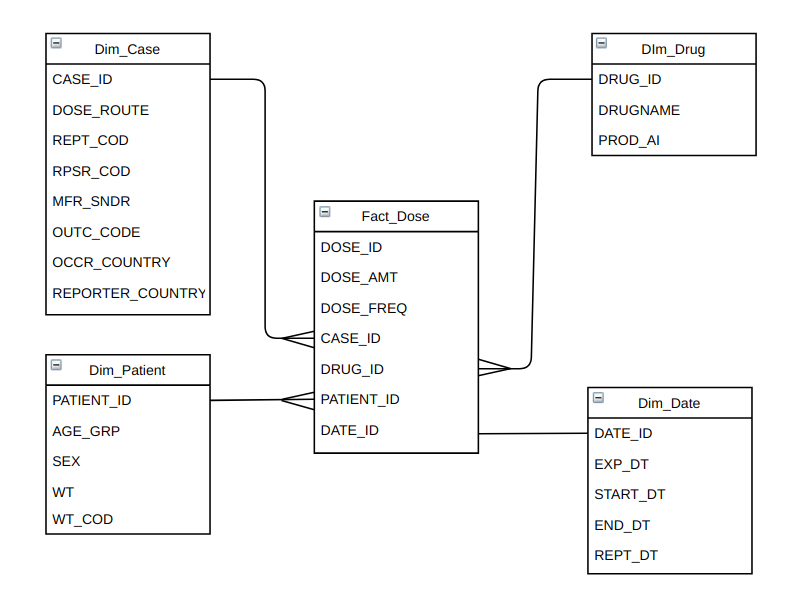

# A sample ETL pipeline

This project extracts the FDA Adverse Event Reporting System (FAERS) Quarterly Data, transforms it and loads it in a data warehouse for future analytics. It is a simple prototype of an ETL pipelines that can be a good starting point for more complex pipelines.

### Technical Description
The data is retreived from CSV documents and staged in a postgreSQL database. Here, the data is cleaned and transformations are applied to it. 
Finally, it is loaded in the data warehouse. Apache Airflow is used to manage and schedule the workflow. The data warehouse schema is a star schema consisting of a fact table and 4 dimension tables as shown below.
A data mart for adverse drug reports can be built from the data warehouse and used to serve the Office of Compliance at FDA's Center for Drug Evaluation and Research. 

##### System Diagram

##### Entity Relationship Diagram

### Source of Data
FDA Adverse Event Reporting System (FAERS) Quarterly Data Extract Files: https://fis.fda.gov/extensions/FPD-QDE-FAERS/FPD-QDE-FAERS.html

